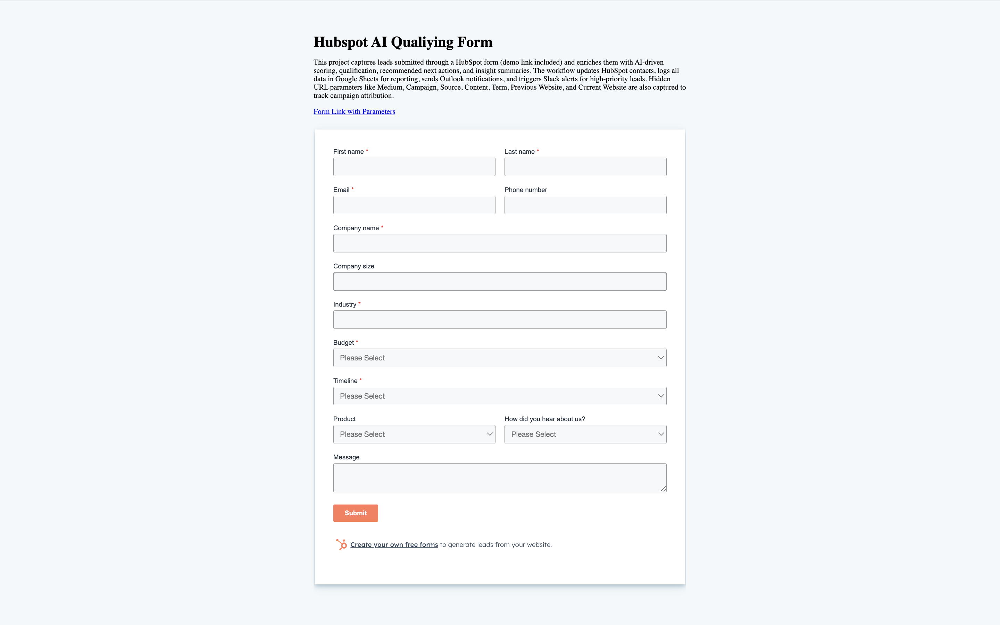
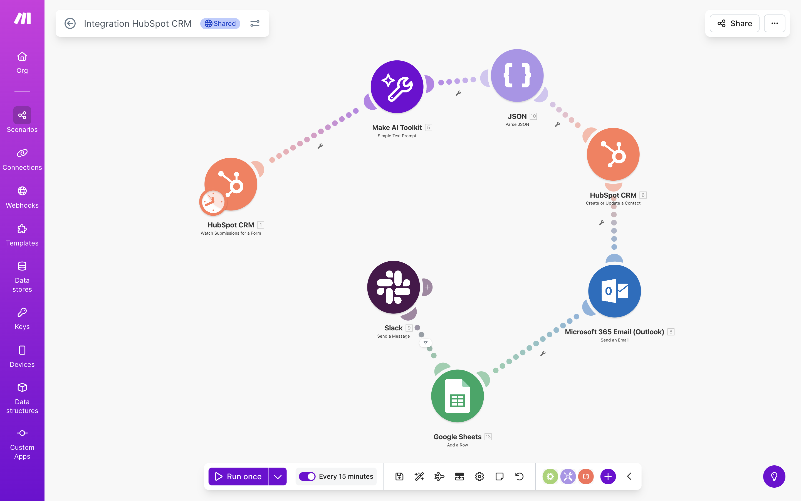

# AI-Enhanced Lead Routing & Scoring Automation

**Make.com, HubSpot CRM, AI Prompting, Google Sheets, Slack, Outlook**

---

## Project Summary

This project automates the go-to-market lead routing process using AI.  
Inbound HubSpot form submissions are analyzed via an AI prompt to generate lead scores, qualification status, next actions, AI confidence, and insight summaries.  
Qualified leads are updated in HubSpot, logged in Google Sheets, trigger email notifications, and high-priority leads notify the owner via Slack for faster follow-up.

---

## Workflow & Features

- AI-powered lead scoring and qualification using Make.com and AI prompt integration  
- Real-time CRM updates in HubSpot  
- Conditional routing: high-priority leads trigger Slack alerts, others receive email notifications  
- Logging of all lead events and AI outputs into Google Sheets for volume, priority distribution, and reporting  
- End-to-end automation from form submission to GTM pipeline triage

---

## Technologies Used

- Make.com & Make AI Toolkit  
- HubSpot CRM & Embedded Forms  
- Google Sheets for tracking & reporting  
- Slack & Outlook for notifications  
- HTML/JavaScript for form embed

---

## Screenshots / Demo

  
  

*Video demo will be added here soon*

---

## Links

- [Live Demo of HubSpot Form](https://javierzavaleta94.github.io/AI-Enhanced-Lead-Routing-Scoring-Automation/)  
- [Google Sheets Tracking Example](https://docs.google.com/spreadsheets/d/14dLw_6fhCe7Xw9jM_ucHWLITzXCvCYpVdReaWtCttKM/edit?usp=sharing)  
- [GitHub Repository](https://github.com/JavierZavaleta94)
